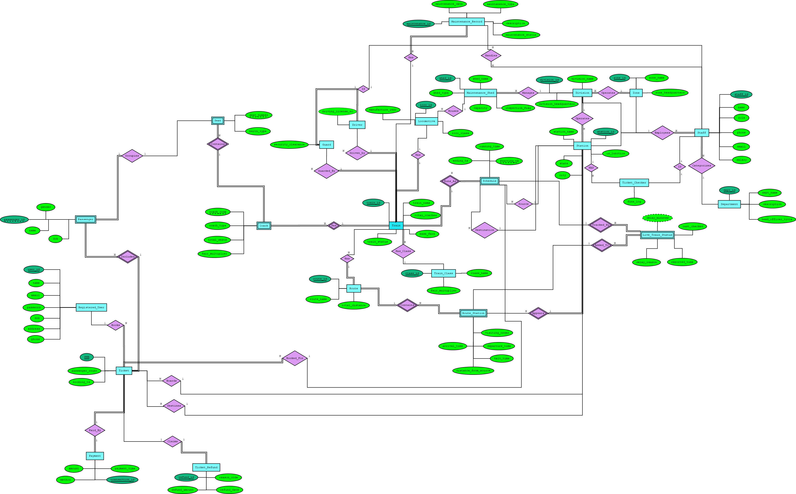
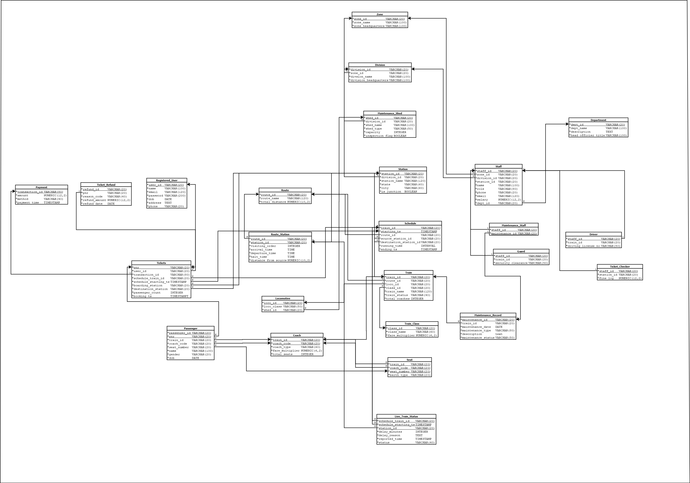

# 🚆 Railway Transport Database System (RTDS)

A relational database design project modelling the core operations of an Indian railway network — from zones and divisions down to individual seat reservations, live train status, and maintenance tracking.

Built with **PostgreSQL**, documented with ERDs and relational schema diagrams, and complemented by a C++ console application for basic querying.

---

## 📋 Table of Contents

- [Project Overview](#-project-overview)
- [Entity-Relationship Diagram](#-entity-relationship-diagram)
- [Relational Schema](#-relational-schema)
- [Database Schema Summary](#-database-schema-summary)
- [Analytical Queries](#-analytical-queries)
- [Tech Stack](#-tech-stack)

---

## 🗂 Project Overview

RTDS models a hierarchical railway system spanning:

- **Organizational hierarchy** — zones → divisions → departments → staff
- **Infrastructure** — stations, routes, route-station sequences, maintenance sheds
- **Rolling stock** — locomotives, trains, coaches, seats
- **Operations** — schedules, live train status, delay tracking
- **Passengers & ticketing** — user registration, booking, PNR lookup, seat assignment, refunds
- **Maintenance** — maintenance records linked to trains and staff

The schema was designed in two iterative stages (ERD Stage 1 → ERD Stage 2 → Final), with full normalization, referential integrity constraints, and meaningful CHECK constraints throughout.

---

## 🗺 Entity-Relationship Diagram

> The ERD was drawn using [Dia Diagram Editor](http://dia-installer.de/). Source `.dia` files are provided in this repository.

---

## 🔗 Relational Schema

---

## 🏗 Database Schema Summary

The schema lives in the `DB_Project` PostgreSQL schema and contains **22 tables**:

| Table | Description |
|---|---|
| `zone` | Top-level railway zones with headquarters |
| `division` | Divisions under each zone |
| `department` | Functional departments (operations, engineering, etc.) |
| `station` | Stations with city, category, junction flag, and division link |
| `route` | Named routes with total distance |
| `route_station` | Ordered sequence of stations per route with timing and platform info |
| `train_class` | Ticket classes (e.g. Sleeper, 3A, 2A) with fare multipliers |
| `train` | Trains linked to routes, locomotives, and classes |
| `locomotive` | Locomotives with status and assigned maintenance shed |
| `maintenance_shed` | Sheds under divisions with type and capacity |
| `maintenance_record` | Per-train maintenance events with type and status |
| `maintenance_staff` | Junction table linking staff to maintenance records |
| `schedule` | Train schedules with source/destination stations and timestamps |
| `live_train_status` | Real-time delay reports per station per schedule |
| `coach` | Coaches attached to trains with AC flag, type, seats, fare multiplier |
| `seat` | Individual seats per coach with berth type |
| `registered_user` | Passenger accounts with contact and authentication fields |
| `payment` | Payment transactions with method and timestamp |
| `tickets` | PNR-keyed bookings linking users, payments, and schedules |
| `passenger` | Individual passengers on a PNR with seat assignment |
| `ticket_refund` | Refund records with reason code and amount |
| `staff` | Employees spanning zones, divisions, departments, and stations |
| `ticket_checker` | Subtype of staff with fine log |
| `driver` | Subtype of staff with driving license and train assignment |
| `guard` | Subtype of staff with security clearance and train assignment |

**Key design decisions:**
- Composite primary keys for `schedule (train_id, starting_ts)`, `passenger (passenger_id, pnr)`, `seat (train_id, coach_code, seat_number)`, and `route_station (route_id, station_id)`
- `ON UPDATE CASCADE` and `ON DELETE RESTRICT/SET NULL/CASCADE` used appropriately throughout
- `CHECK` constraints on fares, distances, capacities, and salary fields
- Staff subtypes (`driver`, `guard`, `ticket_checker`) use shared-primary-key inheritance pattern

---

## 🔍 Analytical Queries

`schema/Query_Solutions.sql` contains **50 queries** covering:

| Category | Queries |
|---|---|
| Train search & scheduling | Trains between two stations in a time window, upcoming schedules per train |
| Booking & PNR | Full booking details by PNR, user booking history, upcoming trips by passenger name/DOB |
| Seat availability | Available seats and per-seat price per coach for a scheduled train |
| Transactions | Atomic booking (BEGIN/COMMIT), refund insertion |
| Revenue analytics | Per-day revenue, payment method breakdown, zone-wise revenue, top spenders |
| Passenger analytics | Daily/weekly passenger counts, 7-day moving average, group size per booking |
| Delay & live status | Average delay per route, top 5 most-delayed stations |
| Staff & HR | Staff count per department/division, salary statistics, transfer update, checker fine logs |
| Maintenance | Locomotives overdue for service, inactive locos by zone, shed inventory |
| Fraud detection | Passengers under multiple accounts, high-cancellation users, burst booking detection |
| Infrastructure | Junction stations by route count, stations in a city with zone/division, coach composition |

---

## 🛠 Tech Stack

| Tool | Purpose |
|---|---|
| PostgreSQL 15 | Primary RDBMS |
| SQL (DDL + DML) | Schema definition, data insertion, analytical queries |
| Dia Diagram Editor | ERD and relational schema diagrams |

---
